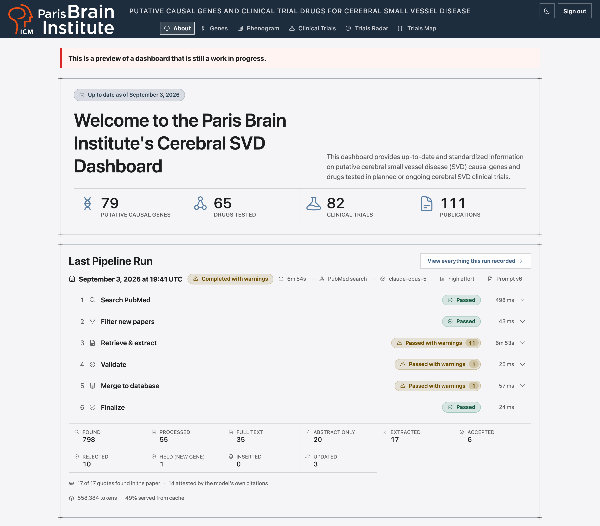
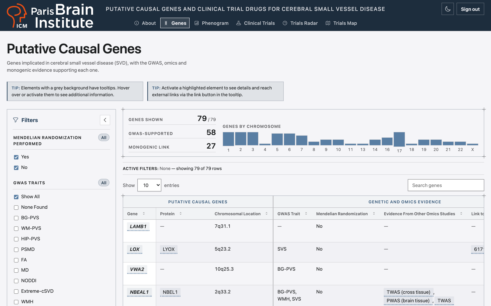
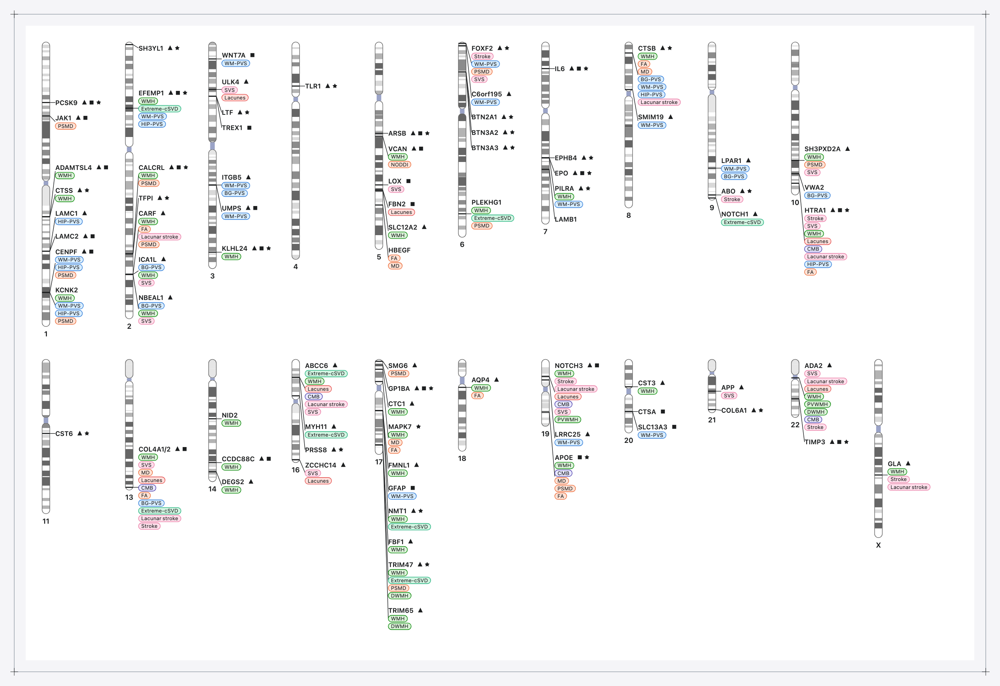
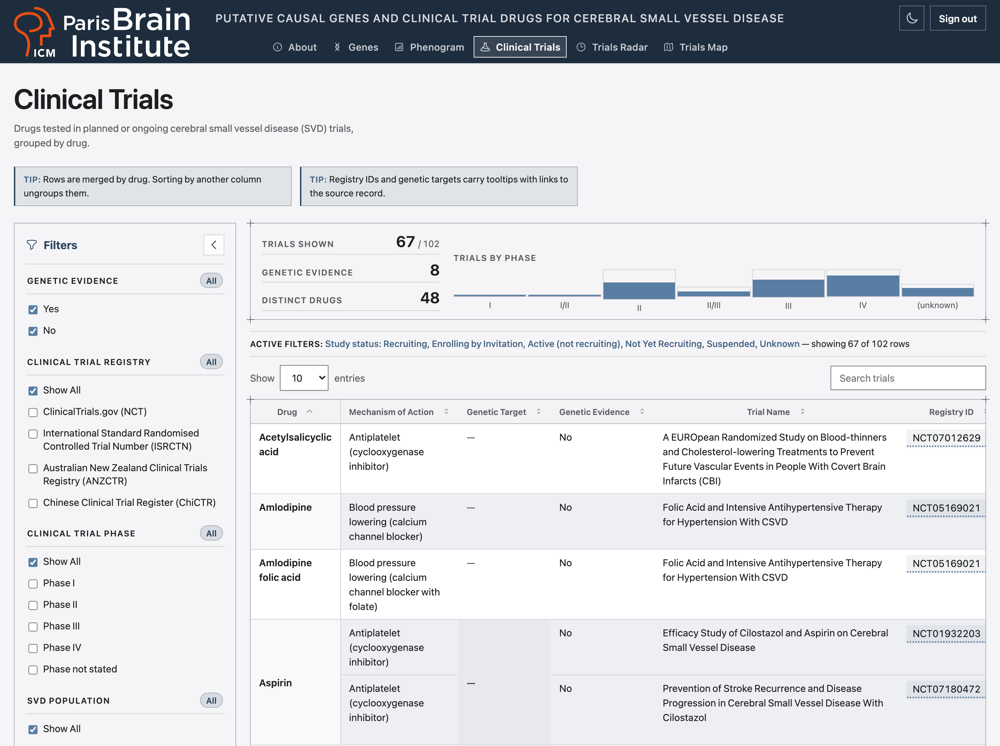
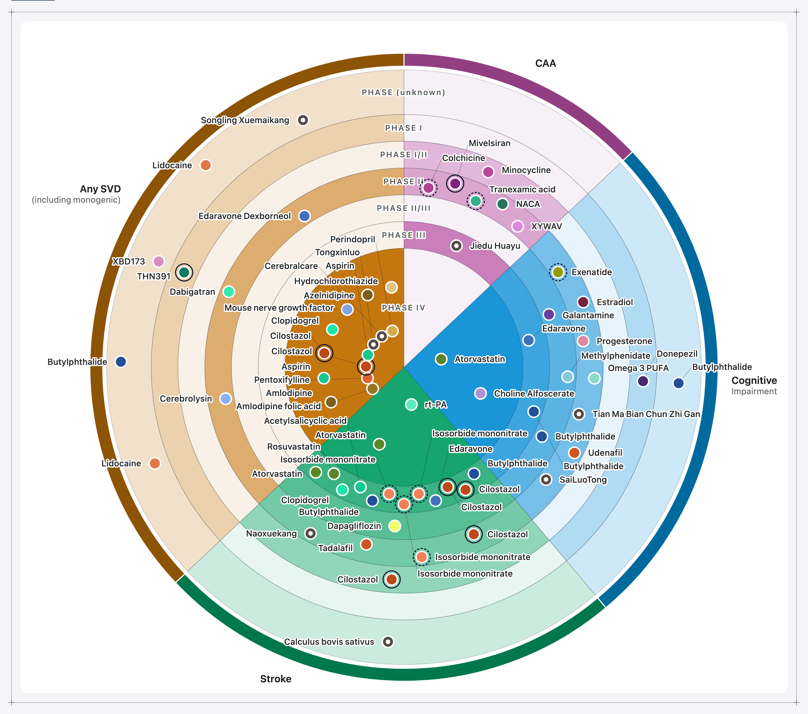
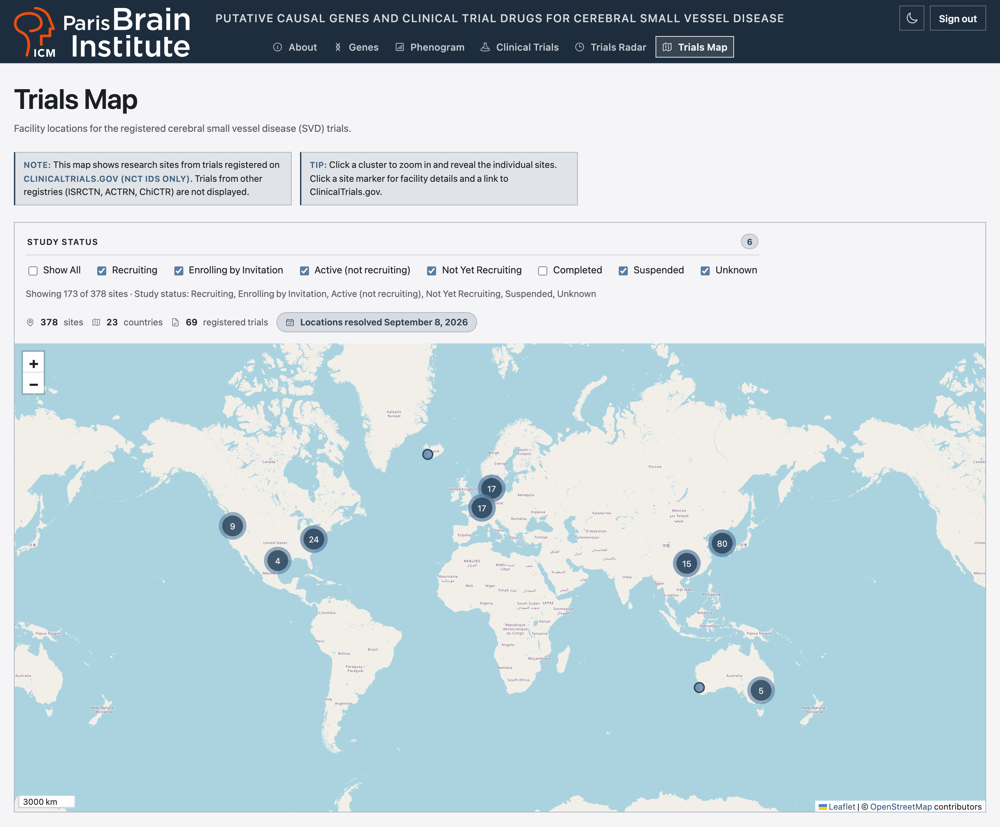

# Genes and Clinical Trials Dashboard

[](LICENSE)
[](mailto:mathieu.poirier@icm-institute.org)
[](https://deno.com/)
[](https://usefresh.dev/)
[](https://www.python.org/)
[](https://www.postgresql.org/)

A dashboard of putative causal genes and clinical trial drugs for one disease,
with the pipeline that keeps it current. This repository's disease is described
in [`disease/README.md`](disease/README.md); everything that names it lives
under `disease/`, so the same code serves another disease from another
`disease/`.

---

## Table of Contents

- [Overview](#overview)
- [Adapting to Another Disease](#adapting-to-another-disease)
- [Technology Stack](#technology-stack)
- [Features](#features)
- [Screenshots](#screenshots)
- [Project Structure](#project-structure)
- [Quick Start](#quick-start)
- [Installation](#installation)
- [Development](#development)
- [Deployment](#deployment)
- [Environment Variables](#environment-variables)
- [Data](#data)
- [Pipeline](#pipeline)
- [Print Figures](#print-figures)
- [Data Sources](#data-sources)
- [Testing](#testing)
- [Notes on the Port](#notes-on-the-port)
- [Contributing](#contributing)
- [License](#license)
- [Contact](#contact)
- [Acknowledgments](#acknowledgments)

---

## Overview

The dashboard provides up-to-date and standardized information on:

- Putative causal genes for the disease `disease/` describes, with the genetic
  and omics evidence behind each one
- Drugs tested in clinical trials for it — planned and ongoing ones by default,
  completed ones a filter away

It is a port of an R Shiny application to a TypeScript web app on Deno + Fresh,
and its data preparation was ported too: a Python pipeline searches PubMed,
extracts genes with an LLM, syncs external annotations into PostgreSQL and
exports JSON.

**One pipeline, one language, meeting the web app at a JSON file boundary.**

```text
PubMed / Europe PMC / CT.gov ──> pipeline/ ──> PostgreSQL ──> pipeline/export/ ──> data/*.json ──> islands
```

Nothing queries a database at request time, and nothing fetches JSON at runtime:
the modules under `lib/data/` import `data/*.json` directly, so an edited file
needs a rebuild or an HMR cycle to show up. [Data](#data) covers how the records
ship and what guards them.

---

## Adapting to Another Disease

Everything that names the disease lives under `disease/`: two manifests with
JSON Schemas beside them, the trait vocabulary, the disease half of the
extraction prompt, the two figures' content, the OMIM CSV, the recall gold set
and its baseline, and the page that describes the disease. The code, the
pipeline and every test outside four `csvd/` trees hold for any disease, and CI
proves it on every push to `main` and every pull request: the `empty-data` job
empties the data, removes those trees and runs every gate, and the `adapt-fork`
job runs every gate on two forks the adapt wizard generated.

[`docs/adapting-to-your-disease.md`](docs/adapting-to-your-disease.md) is the
researcher's guide: fork, answer a nine-question interview that fills
`disease/`, start from `deno task data:empty`, delete the four trees, run the
checks, then run the pipeline and deploy. It assumes a terminal, not TypeScript
or Python. The dashboard also offers the interview as a page, `/adapt`, linked
from About. The site this repository runs sits behind its lab's login, so reach
the page on your own copy: fill `.env` with a passphrase and a session secret,
run `deno task dev` and sign in. The repository ships two Claude Code skills for
the same work: `/new-disease` walks those steps, and `/update-from-upstream`
merges later upstream changes into a fork.

---

## Technology Stack

<!-- markdownlint-disable MD013 MD033 -->
<p align="center">
<a href="https://deno.com/"></a>
<a href="https://usefresh.dev/"></a>
<a href="https://preactjs.com/"></a>
<a href="https://www.typescriptlang.org/"></a>
<a href="https://vite.dev/"></a>
<a href="https://tanstack.com/table"></a>
<a href="https://leafletjs.com/"></a>
<a href="https://floating-ui.com/"></a>
<a href="https://www.python.org/"></a>
<a href="https://docs.astral.sh/uv/"></a>
<a href="https://www.anthropic.com/claude"></a>
<a href="https://github.com/docling-project/docling"></a>
<a href="https://github.com/pydantic/pydantic"></a>
<a href="https://github.com/unionai-oss/pandera"></a>
<a href="https://github.com/pandas-dev/pandas"></a>
<a href="https://github.com/encode/httpx"></a>
<a href="https://biopython.org/"></a>
<a href="https://github.com/MagicStack/asyncpg"></a>
<a href="https://www.postgresql.org/"></a>
<a href="https://alembic.sqlalchemy.org/"></a>
<a href="https://docs.docker.com/dhi/"></a>
<a href="https://playwright.dev/"></a>
<a href="https://github.com/pytest-dev/pytest"></a>
<a href="https://github.com/astral-sh/ruff"></a>
<a href="https://github.com/astral-sh/ty"></a>
</p>
<!-- markdownlint-enable MD013 MD033 -->

| Layer             | Technology                                                                                                                                                                                                                                                                       |
| ----------------- | -------------------------------------------------------------------------------------------------------------------------------------------------------------------------------------------------------------------------------------------------------------------------------- |
| Runtime           | [Deno 2.9](https://deno.com/)                                                                                                                                                                                                                                                    |
| Web framework     | [Fresh 2.3](https://usefresh.dev/) ([Preact 10](https://preactjs.com/) islands) + [Vite 7.3](https://vite.dev/)                                                                                                                                                                  |
| Tables            | [TanStack Table 9](https://tanstack.com/table) (`@tanstack/preact-table`)                                                                                                                                                                                                        |
| Map               | [Leaflet 1.9.4](https://leafletjs.com/) + [Leaflet.markercluster](https://github.com/Leaflet/Leaflet.markercluster)                                                                                                                                                              |
| Tooltips          | Native `[popover]` panels positioned by [Floating UI](https://floating-ui.com/)                                                                                                                                                                                                  |
| Figures (in app)  | Hand-drawn SVG from `lib/timeline.ts` and `lib/phenogram.ts`                                                                                                                                                                                                                     |
| Styling           | One stylesheet (`assets/app.css`), OKLCH tokens, no framework; Barlow Condensed over Barlow self-hosted; [Heroicons v2](https://heroicons.com/) inlined                                                                                                                          |
| Data pipeline     | [Python 3.14](https://www.python.org/) ([uv](https://docs.astral.sh/uv/)), [httpx](https://github.com/encode/httpx), [asyncpg](https://github.com/MagicStack/asyncpg), [Biopython](https://biopython.org/), [lxml](https://lxml.de/), [Rich](https://github.com/Textualize/rich) |
| Validation        | [Pydantic v2](https://github.com/pydantic/pydantic), [Pandera](https://github.com/unionai-oss/pandera), [pandas](https://pandas.pydata.org/)                                                                                                                                     |
| LLM extraction    | [Anthropic Claude Opus 5](https://platform.claude.com/docs/en/models/overview), pinned in `pipeline/config.py`                                                                                                                                                                   |
| PDF fallback      | [Docling](https://github.com/docling-project/docling) + RapidOCR on ONNX Runtime                                                                                                                                                                                                 |
| Database          | [PostgreSQL 18.6](https://www.postgresql.org/), [Alembic](https://alembic.sqlalchemy.org/) migrations; containers run [Docker Hardened Images](https://docs.docker.com/dhi/)                                                                                                     |
| Print figures     | [pyCirclize](https://github.com/moshi4/pyCirclize) (trials radar), [matplotlib](https://matplotlib.org/) (phenogram)                                                                                                                                                             |
| Testing           | `deno test`, [pytest](https://github.com/pytest-dev/pytest), [Playwright](https://playwright.dev/)                                                                                                                                                                               |
| Lint & type-check | `deno fmt` / `deno lint` / `deno check`, [Ruff](https://github.com/astral-sh/ruff), [ty](https://github.com/astral-sh/ty), [basedpyright](https://github.com/DetachHead/basedpyright)                                                                                            |

Vite is pinned to 7.x because `@fresh/plugin-vite` requires `vite@^7.1.4`.

---

## Features

Six tabs, one server-rendered route each, listed in `TABS` (`lib/constants.ts`),
and the adapt page beside them. Interactivity lives in eight Preact islands.

### About (`/`)

- The four totals: genes, drugs, trials and publications
- **Pipeline run report** (`islands/PipelineRun.tsx`) — six timed steps with
  status badges, the funnel from papers fetched to genes accepted, the external
  services the run called, the tokens it used, and a drawer holding everything
  it wrote
- **Reference-data refreshes** (`components/PipelineSyncs.tsx`) — one entry per
  sync mode (`--clinical-trials`, `--sync-external-data`, `--sync-annotations`),
  read from `data/pipeline_syncs.json`
- Data-source attribution with licences, how to cite, and the link to `/adapt`

### Genes (`/genes`)

Table 1 — the curated genes under a grouped two-row header (Putative Causal
Genes, Genetic and Omics Evidence, Expression Context, References, Extraction
Provenance). A summary strip above it counts the genes shown, those with GWAS
support and those with a monogenic link, beside a per-chromosome histogram that
follows the filters.

Filters:

- Mendelian randomization performed (Yes / No)
- GWAS traits — the canonical phenotypes declared in `disease/vocabulary.json`,
  one filter choice and one phenogram pill each
- Evidence from other omics studies (EWAS, TWAS, PWAS, Proteomics, WES/WGS,
  MENTR)

Tooltips carry the linked reference data: NCBI Gene (ID, description, aliases),
UniProt (accession), OMIM (phenotype, inheritance, gene or locus), the PubMed
citation behind each reference, and the full names of cell types and omics
methods.

### Phenogram (`/phenogram`)

Karyogram drawn in-app from `data/table1.json` and `data/cytobands_hg38.json`
(UCSC hg38, 24 chromosomes, 862 bands). The chromosomes that carry a gene are
drawn, to scale, in two rows split after chromosome 10. Each gene sits at the
midpoint of the band its `chromosomalLocation` names, with a label block
carrying its symbol, evidence glyphs and one pill per GWAS trait. Trait identity
is text on a family tint, never colour alone.

### Clinical Trials (`/trials`)

Table 2 — the curated trial rows ([Data](#data) says which publish), merged by
drug while the table is unsorted or sorted by drug, so one drug reads as one
block. A summary strip above it counts the trials shown, those with genetic
evidence and the distinct drugs, beside a per-phase histogram.

Filters:

- Genetic evidence (Yes / No)
- Trial registry (ClinicalTrials.gov, ISRCTN, ANZCTR, ChiCTR)
- Clinical trial phase (I, II, III, IV, or not stated)
- Population — the groups `disease/manifest.json` declares, under the column
  label it names
- Sponsor type (Academic, Industry)
- Study status — every status but Completed is selected at first, so completed
  trials start hidden; the radar and the map share this default

### Trials Radar (`/timeline`)

The trials radar: one sector per declared population × seven phase rings (I to
IV, the seamless I/II and II/III designs, and phase not stated) × one marker per
trial, drawn as SVG from `lib/timeline.ts` and filtered by study status. The
mechanisms of action are grouped into families in `disease/timeline.json` and
coloured one hue per family with lightness steps inside it, because that many
pairwise-distinct hues cannot clear a colour-vision check — identity rides the
drug label and the legend, and the colour says the family first.

Record confidence is two derived channels — nothing is stored, and no curator
marks anything:

- **The evidence ring says whether anybody assessed the drug's genetics.** Solid
  found evidence, dashed looked and found none, no ring means nobody looked.
- **A hollow centre means the record is too thin to read at face value**: an
  uncharacterised mechanism, no stated target enrolment or a stated zero, or no
  stated completion date.

Neither claims a value is wrong: the figure emits no machine verdict.

Two panels divide the record: a pointer-only tooltip identifies a trial at a
glance (five fields, glyphs for names); a keyboard-accessible drawer is the
whole record (all twelve fields). Labels are laid out from measured text — every
one is fitted with `getBBox()`, then pushed clear of the markers and of each
other; a label that ends up further from its marker than its own height gets a
leader line back to it.

### Trials Map (`/map`)

Leaflet map of the geocoded facility sites of the NCT-registered trials — the
study-status filter decides which are shown — on an OpenStreetMap raster basemap
with marker clustering and spiderfication. Coordinates come from
ClinicalTrials.gov's `geoPoint` (city-level), and co-located sites are fanned
out so each stays clickable. A visually-hidden `LocationList` is the text
alternative, because Leaflet's circle markers cannot take focus.

### Adapt (`/adapt`)

Not a tab: linked from About, for a researcher starting a fork for another
disease.

- **The nine-question interview as a form** (`islands/AdaptWizard.tsx`), with
  the lookups a browser can run (NCBI, the Ontology Lookup Service,
  ClinicalTrials.gov) so each answer is chosen over real counts
- Every answer checked as it is typed (`lib/adapt/validate.ts`), and the draft
  kept in the browser between visits
- Downloads `disease-adaptation.zip`: the nine files of `disease/`, the logos, a
  checklist of the steps that follow and the answers themselves;
  `scripts/adapt_fork_check.ts` runs every gate on a fork built from one

### Across every view

- Light / dark theme, following `prefers-color-scheme` until the toggle is used
- Tooltips as native `[popover]` panels — keyboard reachable, Escape closes and
  returns focus
- Both data tables have sticky headers and a sticky identity column, and print
  their `Active Filters:` readout above the table
- The filter sidebar (`components/FilterPanel.tsx`) collapses to a rail rather
  than unmounting, so the toggle keeps focus and the pointer, and hiding the
  controls hides no information
- Both figures sit on a white plate in either theme, so data colours never move

---

## Screenshots

The deployed site sits behind a login, so these are its six tabs as a signed-in
visitor sees them: light theme, this repository's data. `deno task screenshots`
recaptures all six from a fresh production build; rerun it when the data or a
page changes, and in a fork after its first live run.

<!-- markdownlint-disable MD013 MD033 -->
<table>
  <tr valign="top">
    <td width="50%"><strong>About</strong> — the four totals, then the last pipeline run: its six timed steps and the funnel from papers fetched to genes accepted.</td>
    <td width="50%"><strong>Genes</strong> — Table 1 under its grouped two-row header, beside the filters and below the per-chromosome summary.</td>
  </tr>
  <tr valign="top">
    <td></td>
    <td></td>
  </tr>
  <tr valign="top">
    <td><strong>Phenogram</strong> — every gene at its cytogenetic band, with its evidence glyphs and one pill per GWAS trait.</td>
    <td><strong>Clinical Trials</strong> — Table 2, merged by drug so one drug reads as one block.</td>
  </tr>
  <tr valign="top">
    <td></td>
    <td></td>
  </tr>
  <tr valign="top">
    <td><strong>Trials Radar</strong> — one sector per population, one ring per phase and one marker per trial, coloured by mechanism family.</td>
    <td><strong>Trials Map</strong> — the facility sites of the NCT-registered trials, clustered and filtered by study status.</td>
  </tr>
  <tr valign="top">
    <td></td>
    <td></td>
  </tr>
</table>
<!-- markdownlint-enable MD013 MD033 -->

---

## Project Structure

<!-- markdownlint-disable MD033 -->
<details>
<summary><strong>Click to expand project structure</strong></summary>

```text
<repository>/
├── disease/                    everything that names the disease — see
│                               disease/README.md; two manifests and schemas,
│                               the vocabulary, the prompt half, the figures'
│                               content, the OMIM CSV, the recall gold set
│                               and its baseline
├── routes/                     one server-rendered page per tab
│   ├── _app.tsx                document shell, font preloads
│   ├── _middleware.ts          the login gate; fails closed
│   ├── index.tsx               About
│   ├── genes.tsx               Genes (Table 1)
│   ├── phenogram.tsx           Phenogram
│   ├── trials.tsx              Clinical Trials (Table 2)
│   ├── timeline.tsx            Trials Radar
│   ├── map.tsx                 Trials Map
│   ├── login.tsx, logout.tsx   the passphrase form and its counterpart
│   └── adapt.tsx               the adapt wizard's page (not a tab)
├── server/                     middleware in main.ts order, then a shared
│   │                           helper and the two Vite guards
│   ├── compression.ts          gzip ahead of staticFiles(), ETag suffixed
│   ├── frame_protection.ts     framing policy
│   ├── svg_policy.ts           a script-free sandbox for every SVG served
│   ├── protected_data_assets.ts  authenticates the generated-data chunk
│   ├── login_post_limiter.ts   rate limit on POST /login
│   ├── response_header_policy.ts  header rewriting shared by the policies
│   ├── protected_data_build.ts   the Vite plugin that isolates that chunk,
│   │                           with seven data strings as leak canaries
│   └── protected_data_dev.ts   the same gate under the Vite dev server
├── islands/                    the interactive views
│   ├── GenesView.tsx           Table 1, grouped two-row header
│   ├── TrialsView.tsx          Table 2, row-merged by drug
│   ├── TrialsMap.tsx           Leaflet map, clustered markers
│   ├── TrialsTimeline.tsx      the trials radar
│   ├── Phenogram.tsx           the karyogram
│   ├── PipelineRun.tsx         the About page's run report
│   ├── AdaptWizard.tsx         the adapt wizard: interview, lookups, download
│   └── ThemeToggle.tsx         the theme switch
├── components/                 presentational pieces shared by the islands
│   ├── TableShell.tsx          controls, header, body, pagination, the
│   │                           "Active Filters:" line, SHELL_FEATURES
│   ├── CheckboxFilter.tsx      filter groups that can never match nothing
│   ├── Tooltip.tsx             the [popover] panel
│   ├── FilterPanel.tsx         the sidebar-and-table layout, and its rail
│   ├── DensityReadout.tsx      the summary strip: counts and a histogram
│   ├── PipelineSyncs.tsx       the About page's reference-data refreshes
│   ├── Icon.tsx                Heroicons v2 outline, plus four custom glyphs
│   ├── adapt/                  the wizard's steps, cards and fields
│   └── …                       Page, ValueBox, MapPopup, TipBox, …
├── lib/                        types, constants, data loading, filtering
│   ├── data/                   per-file readers and normalizers
│   ├── filters.ts              the only place row selection happens
│   ├── auth.ts                 pure; takes the session secret as an argument
│   ├── sorting.ts              the registered sortFns, `chromosome` among them
│   ├── timeline.ts             radar layout (island half)
│   ├── phenogram.ts            karyogram layout (island half)
│   ├── disease/                the narrow readers over disease/manifest.json
│   ├── adapt/                  the wizard's answers, checks, lookups and
│   │                           the generators that write disease/
│   ├── timeline_encoding.json  radar appearance contract
│   ├── phenogram_encoding.json karyogram appearance contract
│   ├── pipeline_encoding.json  run-widget labels, glyphs and tints
│   └── …                       types, constants, sentinels, theme, tooltips
├── data/                       generated JSON (committed)
├── assets/                     app.css (tokens, all styling) and the
│                               self-hosted fonts
├── static/                     favicons and the institute logos
├── tests/                      *_test.ts(x) for the web app
│   ├── csvd/                   the tests that name this disease's content
│   ├── fixtures/rows.ts        synthetic gene, trial and site rows
│   ├── pipeline/               pytest suite for pipeline/
│   │   └── csvd/               query recall, golden extraction, fixtures
│   └── scripts/                pytest suite for scripts/
│       └── csvd/               the print figures over the committed data
├── e2e/                        Playwright suite (npm-managed, self-contained)
│   ├── fixtures/               expected.deno.ts derives every count under Deno
│   ├── tests/csvd/             the specs that name this disease's content
│   ├── perf/                   the throttled responsiveness harness
│   └── screenshots.mjs         recaptures the README's screenshots
├── docs/
│   ├── adapting-to-your-disease.md  the researcher's guide to a fork
│   └── screenshots/            the README's screenshots, lossless WebP
├── .claude/                    Claude Code guidance: rules/ loads by path,
│                               skills/ holds the nine operational recipes
├── pipeline/                   Python: ingest, extraction, sync, export
│   ├── alembic/versions/       the only definition of the schema
│   ├── export/                 PostgreSQL → data/*.json (main.py), the map
│   │                           (geocode.py) and the empty start (empty.py)
│   ├── disease.py              the stdlib-only reader of disease/pipeline.json
│   ├── main.py                 the CLI
│   ├── prompts.py              the extraction prompt's method half, which
│   │                           disease/prompt.md completes
│   └── steps.py                the one step vocabulary
├── scripts/                    Python: print figures, cytoband fetch, recall
│                               measurement, paper fixtures, one-off
│                               backfills, and the report-only reconcilers;
│                               and adapt_fork_check.ts, the fork simulation
├── main.ts                     the app and its middleware, outermost first
├── vite.config.ts              the Fresh plugin and the data-chunk guards
├── AGENTS.md, CLAUDE.md        guidance for coding agents
├── deno.json                   tasks, import map, coverage floors
└── pyproject.toml              pipeline dependencies, pytest, ruff, coverage
```

</details>
<!-- markdownlint-enable MD033 -->

---

## Quick Start

```bash
# 1. Clone the repository
git clone https://github.com/mathieubpoiriericm/csvd-dashboard.git
cd csvd-dashboard

# 2. Resolve dependencies (nodeModulesDir is "manual" — never implicit)
deno install

# 3. Choose a passphrase and a session secret (the app is gated)
cp .env.example .env
openssl rand -base64 32   # prints a session secret
# then set DASHBOARD_PASSPHRASE='…' (single-quoted) and DASHBOARD_SESSION_SECRET

# 4. Run the app
deno task dev    # http://localhost:5173
```

No database is needed to run the dashboard: the data is committed JSON, bundled
at build time. Every page but `/login` redirects there until the shared
passphrase is entered, and a signed cookie then keeps that browser signed in for
30 days. Failed sign-ins are rate-limited per client and in total, and with
either variable unset every page answers 503 rather than opening.

---

## Installation

### Prerequisites

| Tool                | Needed for                                                  | Version |
| ------------------- | ----------------------------------------------------------- | ------- |
| Deno                | the web app (always)                                        | 2.9+    |
| Node.js + npm       | the Playwright suite, the perf harness, the screenshots     | 26+     |
| uv                  | the Python pipeline and the print figures                   | 0.12+   |
| PostgreSQL          | regenerating `data/` only                                   | 18.6    |
| Apple's `container` | optional: a containerised PostgreSQL, the pytest database   | 1.3+    |
| libwebp (`cwebp`)   | recapturing the screenshots                                 | 1.0+    |
| Tracy               | `deno task perf` (`tracy-import-chrome`, `tracy-csvexport`) | 0.14.1  |

### Web application

```bash
deno install
```

`nodeModulesDir` is `"manual"`, so dependencies are never resolved implicitly —
run this before anything type-checks.

### Python pipeline

`pipeline/` is a [uv](https://docs.astral.sh/uv/) project, entirely separate
from the Deno app. The two meet only at the committed JSON files.

```bash
uv sync --locked --group dev --group figure   # fetches Python 3.14 if needed
```

`--group figure` adds the print-figure renderers that `deno task figure` and
`tests/scripts` need; a later `uv sync` without it removes them again.

`docling` is a **core** dependency, not an optional extra: a fallback path CI
cannot import is a fallback path nobody has proven. It pulls torch and about a
hundred transitive packages, so `[tool.uv.sources]` routes torch to the PyTorch
CPU index on Linux, keeping CI off the ~2.5 GB of CUDA wheels PyPI's default
torch would bring. macOS is unaffected — its arm64 wheels are already CPU/MPS
only.

Docling fetches its layout, TableFormer and RapidOCR weights from Hugging Face
on first use. Prefetch them into `~/.cache/docling/models`:

```bash
deno task models
```

### End-to-end suite

Playwright is a Node tool, so it lives in `e2e/` with its own `package.json` and
its own `node_modules`, kept away from the Deno-managed `node_modules` at the
root. Running `npm install` against a root `package.json` would prune that
symlink farm.

```bash
deno task e2e:install   # npm ci + download the Chromium build
```

### Database

Only needed to regenerate `data/`. Any PostgreSQL 18 reachable through `.env`'s
`DB_*` variables will do. This repository's curated data lives in a native
Homebrew `postgresql@18`, the simplest route on a Mac; the formula is keg-only,
so its client tools need adding to your `PATH`. Create a role and a database to
match `.env`, then build the schema:

```bash
brew install postgresql@18 && brew services start postgresql@18
export PATH="$(brew --prefix postgresql@18)/bin:$PATH"
createuser -P csvd_user                  # type DB_PASSWORD when asked
createdb -O csvd_user csvd_dashboard
cd pipeline && uv run alembic upgrade head
```

On Linux, install your distribution's PostgreSQL 18 and run the two `create*`
commands as the `postgres` user (`sudo -u postgres …`). Alembic reads `.env`
itself. On a machine with no PostgreSQL at all, a container works — never beside
a native server, where it would stand up a second, empty database under the same
name. The maintainer's containers run under Apple's macOS-native
[`container`](https://github.com/apple/container), not Docker, from
**`dhi.io/postgres:18.6`** — a
[Docker Hardened Image](https://docs.docker.com/dhi/) pulled after
`container registry login dhi.io`, chosen over Docker Hub's `postgres:18.6` and
its Alpine variant on a CVE scan:

```bash
container image pull dhi.io/postgres:18.6
container run --detach --name csvd-pg \
  --env POSTGRES_USER=csvd_user --env POSTGRES_PASSWORD=… \
  --env POSTGRES_DB=csvd_dashboard \
  --volume csvd-pgdata:/var/lib/postgresql/18/data \
  dhi.io/postgres:18.6
```

Two details of that image bite: `container` publishes nothing onto the host, so
`container list` prints the address `DB_HOST` has to name; and `PGDATA` is
`/var/lib/postgresql/18/data`, not the official image's
`/var/lib/postgresql/18/docker`, so a volume at the old path leaves the
container initializing an empty database beside it. The rest — backups, the one
table that cannot be rebuilt, why the image is glibc — is in
`.claude/skills/regenerate-data/SKILL.md`.

---

## Development

### Tasks

Tasks live in `deno.json`.

| Task                      | What it does                                    |
| ------------------------- | ----------------------------------------------- |
| `deno task dev`           | Vite dev server with HMR on `:5173`             |
| `deno task build`         | production build into `_fresh/`                 |
| `deno task start`         | serve the build on `127.0.0.1:8000` with `.env` |
| `deno task check`         | `deno fmt --check` + `deno lint` + `deno check` |
| `deno task test`          | unit tests                                      |
| `deno task test:coverage` | unit tests plus enforced coverage floors        |
| `deno task e2e:install`   | `npm ci` + download the Chromium build          |
| `deno task test:e2e`      | build, serve, and drive the app                 |
| `deno task test:e2e:ui`   | the same suite in Playwright's UI mode          |
| `deno task perf`          | throttled responsiveness measurement            |
| `deno task test:perf`     | the perf harness's metric tests, no browser     |
| `deno task screenshots`   | build, then recapture the README's screenshots  |
| `deno task data`          | regenerate `data/` except the map and cytobands |
| `deno task data:empty`    | write the empty `data/` a fork starts from      |
| `deno task geocode`       | regenerate `data/geocoded_trials.json`          |
| `deno task cytobands`     | regenerate `data/cytobands_hg38.json` from UCSC |
| `deno task figure`        | draw both print figures into `figures/`         |
| `deno task fixtures`      | fetch the golden suite's paper fixtures         |
| `deno task models`        | prefetch the Docling model weights              |
| `deno task update`        | run Fresh's own updater against the checkout    |

The pipeline is linted and type-checked through uv; its tests are under
[Testing](#testing).

```bash
uv run ruff check .    # lint (do not run `ruff format`)
uv run ty check        # type-check
```

### Responsiveness

`deno task perf` builds, starts the gated production server and measures every
route's cold, mobile, slow-network and warm loads, the login, fourteen
interactions (table search and controls, tooltips, drawers, the radar's markers,
map zoom and pan), a layout sweep over five viewports and lifecycle checks for
leaks — all under **4x CPU throttling**, because unthrottled on an Apple-silicon
laptop every surface measures as instant. Each figure is the median of five
untraced repetitions.

Each scenario records in-page `PerformanceObserver` metrics (long tasks, INP,
layout shift, TTFB/FCP/LCP, transferred bytes) and a Chromium CDP trace ranked
by self time, which needs Tracy 0.14.1's binaries in `tracy-profiler-0.14.1/` at
the repository root or in `TRACY_DIR` (`node e2e/perf/run.mjs --no-trace`
records the in-page metrics alone). **Read INP, not blocking time, for the
interactions**: the `longtask` API only reports tasks over 50 ms.
`e2e/perf/README.md` has the invocations and the caveats.

### Continuous integration

`.github/workflows/ci.yml` runs five jobs on every push to `main` and every pull
request:

| Job          | Steps                                                                                                                                      |
| ------------ | ------------------------------------------------------------------------------------------------------------------------------------------ |
| `check`      | `deno install`, `deno task check`, `deno task test:coverage`, `deno task test:perf`                                                        |
| `python`     | `uv sync --locked`, Ruff, ty, pytest with branch coverage against a `postgres:18` service, then `tests/scripts` in a step of its own       |
| `e2e`        | Playwright against the production build, report uploaded                                                                                   |
| `empty-data` | `deno task data:empty`, `git rm` of the four `csvd/` trees, then every gate above — the proof that a fork for another disease starts green |
| `adapt-fork` | `scripts/adapt_fork_check.ts --e2e`: two wizard bundles unpacked over copies of the tree, the checklist followed, every gate run on each   |

`uv sync --locked` fails the build if `uv.lock` has drifted from
`pyproject.toml` rather than silently re-resolving. CI does not gate the deploy
(see below).

---

## Deployment

The dashboard is hosted on [Deno Deploy](https://console.deno.com) at
**<https://csvd-dashboard.mathieubpoiriericm.deno.net>**.

Pushing to `main` builds and deploys it; every other branch gets its own preview
URL. CI runs in parallel and does **not** gate the deploy — a red push still
ships, and the remedy is timeline locking in the console rather than a workflow.
Because `data/*.json` is committed and bundled at build time, regenerating data
and pushing it to `main` republishes the site.

### Build configuration

Set through the Deno Deploy console, via the native GitHub integration:

| Field             | Value                             |
| ----------------- | --------------------------------- |
| Framework preset  | `Fresh`                           |
| App directory     | **empty** (deploys from the root) |
| Install command   | `deno install`                    |
| Build command     | `deno task build`                 |
| Runtime config    | Native Fresh integration          |
| Deployment target | Free Regions                      |
| Build timeout     | 5 min (the free-tier ceiling)     |
| Build memory      | 3 GiB                             |
| Runtime memory    | 768 MiB                           |

**Enter the install and build commands explicitly.** The Fresh preset renders
both as greyed placeholders in empty fields, which look identical to values that
have been set. `deno install` is not optional — `nodeModulesDir` is `"manual"`,
so Deno will not populate `node_modules` implicitly and Vite resolves through
it. `.github/workflows/ci.yml` carries the same note for the same reason.

**App directory must be empty, not `/`.** A `/` there produces
`Module not found file:///_fresh/server.js` at the Warm up stage — the error
names the module rather than the field, which makes it the least legible
first-build failure available.

**There is no entrypoint field.** Runtime config is "Native Fresh integration"
and Deploy resolves `_fresh/server.js` itself; the build page reports which
entrypoint it used. Do not hand-configure `_fresh/compiled-entry.js` should the
field ever return: the plugin emits it alongside `server.js`, but it calls
`Deno.serve({ port: Deno.env.get("PORT") })`, passing a string where a number is
required.

A full build runs in about 30 seconds (install ~2 s, `vite build` ~22 s), so the
free tier's 5-minute cap is not a constraint. Deno's version is not pinnable —
the builder runs the same version as the runtime — which is the one upgrade risk
that cannot be controlled from this repo.

### Secrets

`DASHBOARD_PASSPHRASE` and `DASHBOARD_SESSION_SECRET` are set in the console
under `Settings → Environment Variables`, both of type **Secret** and entered
without the quotes `.env` needs. Generate the session secret with
`openssl rand -base64 32`; the passphrase is shared out of band and never
committed. Give both the `Production` and `Development` contexts — preview and
branch URLs run in `Development` — or, to gate those behind a different
passphrase, give this pair `Production` only and add a second pair in
`Development`.

Do not upload the whole `.env`: the web app reads only these two, and the rest
are the pipeline's database password and API keys, which have no use on Deploy.

**A missing secret is a 503 on every route, not a build failure.** The build
cannot see the runtime context, so it goes green and the gate fails closed at
request time. A wholly-503 site after a deploy means a context is missing a
variable. Rotating `DASHBOARD_SESSION_SECRET` logs everyone out at once and is
the only revocation there is; rotating the passphrase leaves existing 30-day
sessions valid.

---

## Environment Variables

Copy `.env.example` to `.env` and fill in real values; `.env` is never
committed, and `deno task dev` and `deno task start` load it themselves. **The
web app needs only the first two**, the only two set on
[Deno Deploy](#deployment); the rest are the pipeline's.

| Variable                                                               | Purpose                                                                 |
| ---------------------------------------------------------------------- | ----------------------------------------------------------------------- |
| `DASHBOARD_PASSPHRASE`                                                 | what collaborators type on `/login`                                     |
| `DASHBOARD_SESSION_SECRET`                                             | signs the 30-day session cookie; rotate to log everyone out             |
| `DB_HOST` … `DB_PASSWORD`                                              | PostgreSQL connection, for the pipeline and Alembic                     |
| `ANTHROPIC_API_KEY`                                                    | LLM gene extraction                                                     |
| `ANTHROPIC_WORKSPACE_ID`                                               | only for an identity-linked key                                         |
| `ENTREZ_EMAIL`                                                         | NCBI E-utilities contact, required by NCBI policy                       |
| `NCBI_API_KEY`                                                         | optional: ten NCBI requests a second rather than three                  |
| `UNPAYWALL_EMAIL`                                                      | open-access PDF lookup                                                  |
| `PIPELINE_LLM_EFFORT`                                                  | cost lever; defaults to `high`                                          |
| `PIPELINE_CONFIDENCE_*`                                                | the two confidence floors (update / insert)                             |
| `PIPELINE_REQUIRE_VERIFIED_QUOTES`                                     | reject a gene whose quote is not verbatim in the paper; off by default  |
| `PIPELINE_MAX_PAPER_TEXT_CHARS`                                        | truncation cap on retrieved full text                                   |
| `PIPELINE_PDF_*`                                                       | Docling OCR, device, threads, page and time caps, model-weights path    |
| `PIPELINE_CLINVAR_*`, `PIPELINE_ORPHADATA_*`, `PIPELINE_OPENTARGETS_*` | annotation rate limits, caps, and the expected Open Targets release     |
| `PIPELINE_NOTIFY_URLS`                                                 | [Apprise](https://github.com/caronc/apprise) URLs for run notifications |
| `PIPELINE_LOG_DIR`                                                     | where run logs go; defaults to `<root>/logs`                            |
| `SSL_CERT_FILE`                                                        | TLS certificate bundle; the pipeline falls back to certifi's            |

**The extraction model is not an environment variable.** It is pinned in
`pipeline/config.py` as `EXTRACTION_MODEL`, because extraction output is
compared across runs, against recorded cassettes and against a gold standard — a
per-machine override would make two runs of the same code incomparable with
nothing saying so. Every knob `.env.example` lists carries its measured
rationale inline; the rest of the `PIPELINE_*` namespace (concurrency, retries,
pool sizes, ClinicalTrials.gov paging) is declared with its default in
`pipeline/config.py`.

---

## Data

The app reads static JSON from `data/`, imported at build time.

| File                    | Shape                                | Source                              |
| ----------------------- | ------------------------------------ | ----------------------------------- |
| `table1.json`           | array of gene rows                   | `genes` table (+ three join tables) |
| `table2.json`           | array of curated trial rows          | `clinical_trials` table (curated)   |
| `gene_info.json`        | one row per Table 1 gene             | `ncbi_gene_info` cache              |
| `gene_info_table2.json` | one row per Table 2 genetic target   | `ncbi_gene_info` cache              |
| `protein_info.json`     | one row per Table 1 gene             | `uniprot_info` cache                |
| `refs.json`             | one row per cited PMID               | `pubmed_citations` cache            |
| `omim_info.json`        | one row per OMIM entry               | `disease/omim_info.csv`             |
| `gene_annotations.json` | one row per `(gene, disease)`        | `gene_annotations` table (pivoted)  |
| `pipeline_status.json`  | one object, or `null` until a run    | `pipeline_runs` table               |
| `pipeline_run.json`     | one report, or `null` until a run    | `pipeline_runs.run_report`          |
| `pipeline_syncs.json`   | one entry per sync mode              | `sync_runs` table                   |
| `geocoded_trials.json`  | `nctIds`, `generatedAt`, `locations` | ClinicalTrials.gov                  |
| `cytobands_hg38.json`   | 862 hg38 bands                       | UCSC Genome Browser                 |

The row counts of this repository's data are in
[`disease/README.md`](disease/README.md). `deno task data:empty` writes the
other end of the range — every file empty or `null`, the OMIM table from the
CSV, the cytobands untouched — which is where a fork starts.

Some of these behave differently from the rest:

- **`gene_annotations.json` is a pivot rather than a table dump** — one row per
  `(gene, disease)` rather than one per cross-reference, of which the table
  holds thousands. Only ClinVar's attested diseases and Orphanet's enrichment of
  them are published; Open Targets' ranked associations and GO terms stay in
  PostgreSQL. No view renders the file: `scripts/reconcile_omim.py` reads it to
  check the curated OMIM links against ClinVar's. It is also the one file
  **skipped rather than emptied** when its table has no rows.
- **`pipeline_run.json` and `pipeline_status.json` are `null` until a run
  records them.** The About page shows the run report when there is one, and
  otherwise the four counts from `pipeline_status.json`.
- **`pipeline_syncs.json` is `[]` until a reference-data refresh is recorded**,
  one entry per sync mode. A refresh is a separate event from a run, so it has
  its own table and file, and no query feeding the run widget or the About
  page's date badge can see one. It is what publishes the upstreams only the
  syncs touch: ClinVar, Orphadata, Open Targets, UniProt and ClinicalTrials.gov.
- **`cytobands_hg38.json` is not the export's output** but
  `scripts/fetch_cytobands.py`'s, so `deno fmt --check .` gates its formatting
  rather than the byte-exact writer test.

**`table2.json` publishes only curated trial rows.** `--clinical-trials` writes
ClinicalTrials.gov discoveries into the same table with every curator column
NULL; `_read_curated_trials` skips any row with no `target_population` and logs
the count, so a discovery no one has read cannot reach the dashboard as
`(unknown)` mechanism, population and evidence — values no filter choice offers
and the radar draws nowhere. A trial ClinicalTrials.gov reports as terminated or
withdrawn is not published either.

### How the data ships

The modules under `lib/data/` import each file with
`import … with { type: "json" }`, so it is bundled into whatever imports it.
**Import the narrow module, not the barrel**: `lib/data.ts` re-exports all of
them, and an island that reaches for it pulls the whole ~400 KB dataset into its
client bundle instead of the one table it renders.

The files are never served as they are. In production, Vite groups the records
and their `lib/data/` normalization layer into one `protected-data-<hash>.js`
chunk, and the build fails if one of those modules lands in a public chunk.
Server middleware authenticates that chunk before static serving and sends it
`private, no-store`, as the login gate sends every page `no-store`, so neither
stays in a shared or browser cache. Login CSS, fonts, icons and bootstrap code
stay public so the signed-out login page renders. `compression()`, the outermost
middleware in `main.ts`, gzips the protected chunk and the static bundles alike,
which took every route from 760–1000 KB to 204–255 KB.

### Regenerating

Requires PostgreSQL reachable, `.env` populated and the schema at head — run
`cd pipeline && uv run alembic upgrade head` after pulling a new migration.

```bash
deno task data      # pipeline/export/main.py    → every other data/ file
deno task geocode   # pipeline/export/geocode.py → data/geocoded_trials.json
deno task cytobands # scripts/fetch_cytobands.py → data/cytobands_hg38.json
```

`deno task geocode` asks ClinicalTrials.gov for every trial's locations in one
`filter.ids` request, so it needs no cache and no rate limit. No geocoding
service is involved: coordinates are the registry's own `geoPoint`, computed
from each site's city, state and country — city-level, not facility-level — and
`jitter_duplicate_coordinates()` fans out co-located sites. Run it after any
`deno task data` that adds a trial, or `tests/data_contract_test.ts` fails on
the `nctIds` set.

### The JSON contract

`pipeline/export/writer.py`'s `to_camel()` derives JSON keys from display column
names (`"Registry ID"` → `registryId`). Three layers stay in sync:

| Concern               | Lives in                                 |
| --------------------- | ---------------------------------------- |
| Wire keys             | `pipeline/export/writer.py` (`to_camel`) |
| TypeScript shapes     | `lib/types.ts`                           |
| Human-readable labels | `islands/*View.tsx` column definitions   |

Two invariants the TypeScript side depends on:

1. **List-columns are always arrays**: `gwasTrait`,
   `evidenceFromOtherOmicsStudies`, `linkToMonogenicDisease` and `references` on
   `Gene`, `omimSeries` and `relatedXrefs` on `GeneAnnotation`.
2. **Sentinel strings are load-bearing.** Absent values become `"(none found)"`,
   `"(unknown)"`, `"(none)"` and are matched literally by the filter choices in
   `lib/constants.ts`, so those `value`s must stay byte-identical to what
   `pipeline/export/tables.py` emits.

**JSON output is byte-exact, and every exported file is gated on it.**
`tests/pipeline/export/test_writer.py` parses each `data/*.json`, re-encodes it
through the writer and compares the bytes; a companion test fails if a file
appears in `data/` with no case. This is what catches a formatting divergence
before it turns the first regeneration into an unreviewable whole-file diff.
Every export query therefore needs an `ORDER BY` — without one PostgreSQL
returns rows in whatever physical order it likes.

---

## Pipeline

`pipeline/` populates PostgreSQL and exports it to `data/*.json`.

```text
PubMed search (SVD_QUERY)
      │
      ▼
Retrieve full text     Europe PMC JATS XML, Docling PDF fallback (~15%)
      │
      ▼
Extract genes          Claude Opus 5, structured output
      │
      ▼
Validate               NCBI Gene lookup, then the two confidence floors
      │
      ▼
Merge  ────────────>   PostgreSQL   <────  ClinVar / Orphadata / Open Targets
                            │              NCBI Gene / UniProt / citations
                            │              ClinicalTrials.gov
                            ▼
                       pipeline/export/  ──>  data/*.json  ──>  Fresh islands
```

### Running it

```bash
uv run python -m pipeline.main [flags]
```

| Flag                   | Effect                                                         |
| ---------------------- | -------------------------------------------------------------- |
| `--pubmed`             | PubMed gene extraction (also the default with no selector)     |
| `--days-back N`        | lookback window for new papers (default 7)                     |
| `--batch`              | submit every paper in one Batch API request at half price      |
| `--clinical-trials`    | the ClinicalTrials.gov discovery pipeline                      |
| `--sync-external-data` | NCBI Gene, UniProt and PubMed citations for every gene         |
| `--sync-annotations`   | ClinVar, Orphadata and Open Targets annotations                |
| `--export`             | regenerate `data/*.json` when the selected pipelines finish    |
| `--local-pdfs PATH`    | extract from a local PDF or directory (no PubMed, no database) |
| `--pmids FILE`         | process specific PMIDs from a text file (no database)          |
| `--skip-validation`    | skip NCBI validation (only with `--local-pdfs` or `--pmids`)   |
| `--dry-run`            | extract but write nothing to the database (still billed)       |
| `--test-mode`          | search and deduplicate only: no retrieval, LLM or merge        |

The four pipeline selectors combine and run in sequence. `--days-back`,
`--batch`, `--dry-run` and `--test-mode` apply to the PubMed pipeline only, and
`--local-pdfs` / `--pmids` run on their own. `--batch` results usually arrive
within an hour; the default streaming path stays better for small runs.

A long `--days-back` run is **resumable**: every paper is checkpointed to
`logs/pipeline_checkpoint.jsonl` as it finishes, so a crash costs the papers in
flight and nothing else — re-run the same command. `--batch` is the exception:
every paper is in flight until the batch's results arrive, and the batch id is
held only in the run log, so a crash inside the poll loses the whole submission
and re-running pays again. `uv run python -m scripts.backfill_pubmed` walks the
window in committed chunks instead, for when the database should be updated as
it goes.

`--export` does `deno task data`'s work at the end of a live run, so the
figures, the About page's date and the run widget track the database without a
second command. A PubMed run first fetches the NCBI Gene, UniProt and citation
records for the genes and papers it merged, so the export does not publish them
blank. It **stops at the working tree** — nothing is committed, because the
curated `genes` table is a scientific judgement and the e2e fixtures pin exact
row counts. It is refused with `--local-pdfs` / `--pmids`, skipped after
`--dry-run` or `--test-mode`, and runs even when a pipeline **failed**, because
not exporting is what would keep that recorded failure invisible.

A run is recorded as six timed steps — Search PubMed, Filter new papers,
Retrieve & extract, Validate, Merge to database, Finalize — declared once in
`pipeline/steps.py` and read by the About page's widget through
`lib/pipeline_encoding.json`.

### Retrieval

`SVD_QUERY` in `pipeline/pubmed_search.py` is assembled from the search terms in
`disease/pipeline.json` — two Title/Abstract branches anchored on the disease's
name, and a third, `MESH_TERMS AND GENETIC_TERMS`, that reaches papers which
never write the name out in the title or abstract. The genetics gate on the MeSH
branch is what keeps a broad heading from multiplying ingestion; the genetic and
marker term lists are precision filters on the anchored branches and contribute
no recall of their own.

Its recall is measured rather than assumed. The gold set is
`disease/recall_gold.csv` plus every PMID `data/table1.json` cites, and
`uv run python -m scripts.measure_recall` intersects the query with a `[uid]`
disjunction over it — exact rather than sampled, and never meeting PubMed's
9,999-record `esearch` cap, because the result set can never exceed the gold
set. `--write-baseline` records the figure in `disease/recall_baseline.json`,
and `tests/pipeline/test_query_recall_gold.py` replays it from a cassette so a
query edit that loses a gold paper fails in CI. The measurement for this
repository's query, and the papers it misses, are in
[`disease/README.md`](disease/README.md).

### PDF fallback

`docling` extracts structured tables from the PDF path — the ~15% of papers
Europe PMC's JATS XML doesn't cover. OCR runs through RapidOCR on ONNX Runtime,
and is a fallback rather than a mode: Docling's default `OcrMode` drops every
layout cluster that already holds programmatic text. Measured over six corpus
papers on an M1 Pro, OCR takes the PDF path from 59.7 s to 106.9 s for
**byte-identical** output, while one of them rasterised to strip its text layer
yields 97.5% of its text with OCR and 14% without. The cost is real, the risk is
not. `PIPELINE_PDF_OCR=false` disables it; the other `PIPELINE_PDF_*` knobs and
their measurements are documented in `.env.example`.

### Annotations

`--sync-annotations` fetches disease, ontology and identity annotations for the
curated genes from ClinVar, Orphadata and Open Targets, and verifies Table 2's
curator-entered mechanisms against Open Targets' ChEMBL records.

**The curated `genes` table is never written by any of it**, and there is no
foreign key to it either, so an annotation run cannot lock or cascade into it.
The acceptance criterion is that `max(updated_at)` on `genes` is unchanged
across a full run.

### Schema

Alembic is the only definition of the schema — there is no ORM model file and no
checked-in DDL beside it.

```bash
cd pipeline && uv run alembic upgrade head
```

Fourteen migrations define `genes`, its three join tables (`gene_references`,
`gene_gwas_traits`, `gene_monogenic_links`), `clinical_trials`,
`ncbi_gene_info`, `uniprot_info`, `pubmed_citations`, `pubmed_refs`,
`gene_annotations`, `gene_annotation_status`, `trial_drug_annotations`,
`pipeline_runs` and `sync_runs`.

The three gene list columns moved out of delimited TEXT into join tables in
migrations 005 and 006 because `references` had already been destroyed once by a
spreadsheet round-trip that read the whole PMID list as one number. One value
per row makes that impossible rather than merely detectable.

---

## Print Figures

Both figures are drawn twice from the same committed JSON and the same encoding
files — once for the browser, once for print — and the layout rule is pinned on
both sides so a change has to be made twice or fails.

```bash
deno task figure   # figures/{timeline,phenogram}.{svg,pdf,png}

# or with a specific font and resolution
uv run --group figure scripts/timeline_figure.py --font /path/to/Arial.ttf --dpi 600
```

| Figure       | Island                       | Print script                  | Library    |
| ------------ | ---------------------------- | ----------------------------- | ---------- |
| Trials radar | `islands/TrialsTimeline.tsx` | `scripts/timeline_figure.py`  | pyCirclize |
| Phenogram    | `islands/Phenogram.tsx`      | `scripts/phenogram_figure.py` | matplotlib |

`figures/` is gitignored: the outputs are regenerated, not committed. The SVG
keeps text as text (`svg.fonttype = none`), so it stays editable; the PDF embeds
the font.

---

## Data Sources

| Source                                                                    | Provides                                                           | Licence             |
| ------------------------------------------------------------------------- | ------------------------------------------------------------------ | ------------------- |
| [PubMed / NCBI E-utilities](https://www.ncbi.nlm.nih.gov/books/NBK25501/) | Paper search and citation metadata                                 | NCBI, public domain |
| [Europe PMC](https://europepmc.org/)                                      | Full-text JATS XML                                                 | per-article         |
| [Unpaywall](https://unpaywall.org/)                                       | Open-access PDF locations for the fallback path                    | CC0                 |
| [NCBI Gene](https://www.ncbi.nlm.nih.gov/gene)                            | Gene identity, aliases, validation                                 | NCBI, public domain |
| [UniProt](https://www.uniprot.org/)                                       | Protein data and accessions                                        | CC BY 4.0           |
| [OMIM](https://www.omim.org/)                                             | Phenotype, inheritance, gene/locus (curated CSV)                   | OMIM terms          |
| [ClinVar](https://www.ncbi.nlm.nih.gov/clinvar/)                          | Monogenic disease associations and clinical significance           | NCBI, public domain |
| [Orphanet / Orphadata](https://www.orphadata.com/)                        | Disease cross-references with mapping relation, HPO frequencies    | CC BY 4.0           |
| [Open Targets Platform](https://platform.opentargets.org/)                | Identity anchors, ranked associations, GO terms, ChEMBL mechanisms | CC0 1.0             |
| [ClinicalTrials.gov API v2](https://clinicaltrials.gov/data-api/api)      | Trial metadata and facility `geoPoint` coordinates                 | NLM terms           |
| [UCSC Genome Browser](https://genome.ucsc.edu/)                           | hg38 cytoband ideogram                                             | UCSC terms          |

Trial registries carried in Table 2: ClinicalTrials.gov, ISRCTN, ANZCTR, ChiCTR.
Only ClinicalTrials.gov trials appear on the map — the others have no comparable
location API.

Attribution here is a licence obligation, not a courtesy: Orphadata is CC BY 4.0
and asserts that in every payload, and the pipeline logs an error if the
asserted licence ever changes.

Two services reach the browser rather than `data/`: the Trials Map's basemap
tiles come from OpenStreetMap (© OpenStreetMap contributors, ODbL, credited on
the map), and the adapt wizard looks up ontology terms in EMBL-EBI's
[Ontology Lookup Service](https://www.ebi.ac.uk/ols4/).

---

## Testing

| Suite                   | Runner      | Scope                                                                   |
| ----------------------- | ----------- | ----------------------------------------------------------------------- |
| `tests/**/*_test.ts(x)` | `deno test` | Web app: filters, data contract, layout maths, SSR routes, adapt wizard |
| `tests/pipeline/`       | pytest      | The Python pipeline and its export                                      |
| `tests/scripts/`        | pytest      | The print figures, cytoband fetch, backfills, reconcilers               |
| `e2e/tests/`            | Playwright  | The specs plus the sign-in setup, against the production build          |

```bash
deno task test                # web app
deno task test:coverage       # plus the enforced floors
uv run pytest                 # tests/pipeline only (testpaths in pyproject.toml)
uv run pytest tests/scripts   # by name, after touching scripts/
deno task test:e2e            # builds, serves and drives the app
cd e2e && npx playwright test tests/genes-filters.spec.ts   # a single spec
```

CI runs every suite in three modes. On the committed data, every test holds. On
`deno task data:empty` — every `data/*.json` empty or `null` — with the four
`csvd/` trees removed, the rest still pass, because a test that pins a number
derives it from the committed JSON at test time (`e2e/fixtures/expected.deno.ts`
runs under Deno so the counts come from the app's own `lib/`) or skips with a
reason naming the empty file. In the third, `scripts/adapt_fork_check.ts` runs
every gate on two forks the adapt wizard generated. The tests that name this
disease's content — the query recall, the golden extraction suite and its gold
standard, the prompt's byte identity, the figure layouts over the committed rows
— live in those trees (`tests/csvd`, `tests/pipeline/csvd`,
`tests/scripts/csvd`, `e2e/tests/csvd`). A fork removes them with one
`git rm -r`, and the upstream recall cassettes in
`tests/pipeline/cassettes/test_query_recall_gold/` with another.

The golden extraction suite (`tests/pipeline/csvd/test_extraction_golden.py`) is
the one part of `tests/pipeline/` that CI never runs. Its inputs are publisher
text and are not committed: `deno task fixtures` fetches the full-text paper
fixtures from Europe PMC, and the VCR cassettes that replay the model's answers
are recorded locally with an `ANTHROPIC_API_KEY` (the recipe is in the module's
docstring). Without them its tests skip with a reason naming the command, so a
green CI says nothing about extraction recall.

`deno task test:e2e` builds and serves the app itself — no `deno task dev`
needed, and no database, since the data is bundled at build time. It also logs
in itself: the server is started with the suite's own passphrase, a `setup`
project signs in once, and every other spec starts from the saved session.
Outside CI it reuses a server already listening on port 8000, which then has to
have been started with those credentials — stop `deno task start` first, or set
`E2E_PORT` to a free port.

Tests never touch the database `.env` names: `tests/pipeline/conftest.py` clears
the `DB_*` variables and the whole `PIPELINE_*` namespace. A test needing real
SQL uses the throwaway database `CSVD_TEST_DB_URL` names (CI's `postgres:18`
service) or, with that unset, brings up its own `dhi.io/postgres:18-alpine3.23`
container under Apple's `container` (so macOS only) and destroys it with the
session; with neither, those tests skip.

### Coverage

`deno task test:coverage` enforces **100% line, branch and function coverage for
the shared `lib/` logic**, and gates the complete server-rendered unit graph at
85% lines, 95% branches, 90% functions. Browser-only effects — Leaflet, popover
positioning, font measurement, focus management, hydrated event handlers — are
covered by the Playwright suite rather than simulated under Deno.

The pipeline gate is **99.5% line and branch coverage** (`fail_under` in
`pyproject.toml`), measured over both `pipeline/` and Alembic's non-package
migration scripts.

The suites under the four `csvd/` trees are deliberately pinned to the _real
committed rows_ — exact filter counts, the first marker the radar draws, the
search counts for a named disease — so regenerating `data/` can legitimately
turn them red; check whether the data changed before "fixing" the filter.
Everything outside those trees derives what it pins.

### What the test suite does not cover

Two gaps worth knowing before you trust a green run.

- **Extraction quality is measured, but not by raw F1.** The golden suite
  asserts recall over the gold genes each paper's _retrieved text actually
  names_, and reports apart the ones the rendered prompt itself names. **Quote
  the clean subset**: it measures extraction rather than recall of the prompt,
  and `test_the_prompt_names_part_of_its_own_answer_key` pins how many gold
  genes the prompt names, so a prompt edit cannot quietly inflate the figure.
  The measurements, and the recording-to-recording noise they carry, are in
  [`disease/README.md`](disease/README.md). Raw set-F1 is much lower, for
  reasons that are mostly not extraction: gold gene-paper pairs name genes the
  retrieved text never mentions, and the gold standard holds the genes the
  curators judged causal, not every gene a paper implicates. Still unmeasured:
  the Docling PDF path, negative cases (no gold row reports zero genes), and
  everything after `extract_from_paper` — the confidence gate and NCBI
  validation.

- **Retrieval precision is not measured.** Recall is exact, but the argument for
  the MeSH branch is a volume argument — more papers for a few more gold ones —
  not a relevance one. Nothing here says what fraction of the extra papers is
  signal, and settling it needs relevance judgments over a sample.

---

## Notes on the Port

Behaviour matches the Shiny app except where it was demonstrably wrong.

- **Filter matching normalizes case and surrounding whitespace on both sides.**
  The R version compared raw strings, so the "Proteomics" choice never matched
  (the data says "proteomics"), and traits stored with a trailing space were
  missed by their own filter. Both failed closed, hiding rows.
- **The OMIM CSV is UTF-8, like every other file here.** It was Mac Roman until
  the seven stray `0xCA` bytes it carried — U+00A0 non-breaking spaces pasted in
  from omim.org — were folded into ordinary spaces at the source, leaving it
  pure ASCII. `read_omim_csv` decodes UTF-8, so a Mac Roman re-paste now raises
  instead of being admitted silently; it still folds a correctly-encoded U+00A0,
  because web copy-paste is where this data comes from.
- **Nothing is embedded in an iframe any more.** Both figures are drawn in-app
  from the committed JSON. The last iframe, the phenogram, was a PhenoGram
  raster with pixel-colour hit-testing that had drifted from the data — one gene
  labelled as another, two missing.
- **The trait vocabulary has one home.** `disease/vocabulary.json` defines every
  trait — label, family, long name, definition, ontology xref (or an explicit
  `null` with the reason), synonyms — and the deliberately untracked prompt
  terms. Restating it is what let the second most extracted trait have no filter
  choice and no phenogram entry.
- **The extraction prompt is reconciled, not generated.** Its
  canonical-abbreviation sentence is prose in `disease/prompt.md`, rendered into
  the template in `pipeline/prompts.py`, rather than derived from
  `disease/vocabulary.json`, because what the model is asked is part of the
  method; `tests/pipeline/test_prompt_vocabulary.py` reconciles the two in both
  directions instead.
- **Tooltips are native `[popover]` panels.** This replaced Tippy 6.3.7, whose
  repo is archived and whose Popper v2 engine is frozen.

---

## Contributing

1. **Fork** the repository
2. **Create** a feature branch (`git checkout -b feature/amazing-feature`)
3. **Commit** your changes (`git commit -m 'Add amazing feature'`)
4. **Push** to the branch (`git push origin feature/amazing-feature`)
5. **Open** a Pull Request

### Guidelines

- Run the gates CI runs before pushing: `deno task check`,
  `deno task test:coverage`, `uv run ruff check .`, `uv run ty check`,
  `uv run pytest`, `uv run pytest tests/scripts` and `deno task test:e2e`
- A test that names this disease's content or pins one of its numbers goes in a
  `csvd/` tree; everything else must also pass on `deno task data:empty`
- Add tests for new functionality — and when a change touches an encoding file,
  add the entry rather than widening the test
- Keep commits focused and atomic

### Reporting issues

Found a bug or have a suggestion? Please
[open an issue](https://github.com/mathieubpoiriericm/csvd-dashboard/issues)
with:

- A clear description of the problem or enhancement
- Steps to reproduce (for bugs)
- Expected vs actual behaviour

---

## License

MIT — see [LICENSE](LICENSE). That licence covers the software. The committed
`data/*.json` is derived from the sources in the [Data Sources](#data-sources)
table and carries their terms, not MIT's — OMIM's in particular, whose data is
not freely redistributable.

---

## Contact

**Maintenance**: <mathieu.poirier@icm-institute.org>

---

## Acknowledgments

Developed at the Paris Brain Institute (ICM).
